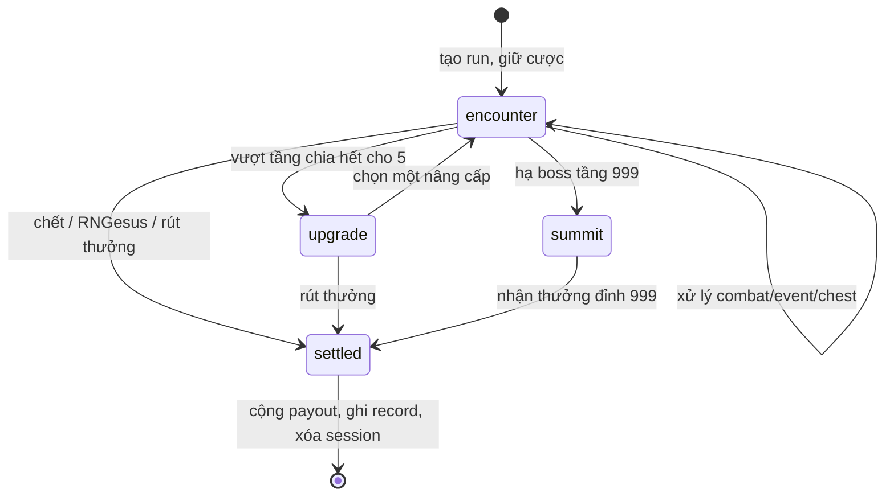

# Đặc tả kỹ thuật — Sinh tồn Median XL 999 tầng

> Các thay đổi của release 02/10/2026, gồm event mới, item rework và công thức hiện hành: [`2026-10-02-hardcore-survival-rework-changelog.md`](./2026-10-02-hardcore-survival-rework-changelog.md)

**Ngày chốt đặc tả:** 01/10/2026  
**Phiên bản tham chiếu:** bot 2.0.0  
**Mục đích:** tài liệu bàn giao để một lập trình viên hoặc AI khác có thể dựng lại chế độ Sinh tồn với cùng luật, cùng công thức và cùng hành vi lưu phiên.  
**Phạm vi:** engine game, xác suất, class, skill, boss, item, payout, SQLite, Discord UI, khôi phục phiên, chống xử lý trùng và kiểm thử.  

Tài liệu này là đặc tả chuẩn của bản đang chạy. Các từ **PHẢI**, **KHÔNG ĐƯỢC** và **NÊN** mang nghĩa yêu cầu triển khai. Nếu code mới khác tài liệu, ưu tiên sửa code hoặc cập nhật đặc tả một cách có chủ đích; không âm thầm thay đổi công thức.

---

## 1. Mục tiêu sản phẩm

Sinh tồn là game một người, có đặt cược, gồm tối đa 999 tầng. Người chơi:

1. Chọn một trong bảy class và đặt cược.
2. Vượt từng encounter bằng nút Discord.
3. Tự chọn thời điểm rút payout.
4. Mất toàn bộ payout chưa rút nếu chết.
5. Được ghi nhận hoàn thành chính thức từ tầng 100.
6. Có thể tiếp tục Overrun tới tầng 999; tầng 999 chỉ hoàn tất sau khi hạ Deimoss cuối.

Trang bị nhận trong Sinh tồn chỉ tồn tại trong run. Nó không đi vào inventory chung và biến mất khi run kết thúc.

### 1.1. Các bất biến quan trọng

- Một người chỉ có tối đa một run hoạt động trong mỗi server.
- Tiền cược bị trừ ngay lúc tạo run; kết thúc run chỉ cộng payout, không trừ cược lần thứ hai.
- Mọi lựa chọn làm đổi state phải chạy trong transaction SQLite.
- Một Discord button cũ không được phép thực hiện lại lượt đã xử lý.
- Mọi kết quả ngẫu nhiên đã roll phải nằm trong `state_json`; restart bot không được roll lại encounter hiện tại.
- Payout tối đa là `10.000.000` xu.
- RNGesus không thể bị đánh bại.
- Boss tầng 999 không thể bị bỏ qua.
- Chỉ số và vật phẩm có thể tăng rất lớn nhưng HP và damage quái bị chặn ở `1.000.000.000.000` để tránh số vô hạn.

---

## 2. Giao diện lệnh

Các đường vào tương đương:

```text
/choi sinhton batdau
/choi sinhton tieptuc
/choi sinhton hoso [nguoidung]
/choi sinhton xephang
/choi sinhton tyle

!sinhton <xu> <class>
!sinhton tieptuc
```

Tên class nội bộ: `amazon`, `assassin`, `barbarian`, `druid`, `necromancer`, `paladin`, `sorceress`.

Giá trị cược hợp lệ còn phải nhỏ hơn hoặc bằng giới hạn `hardcore` riêng của server. Lệnh bắt đầu chỉ dùng trong channel đã cấu hình cho Sinh tồn. Lệnh hồ sơ, bảng xếp hạng và tỷ lệ có thể là response riêng tư.

Slash `batdau` mở bảng chuẩn bị riêng tư. Người chơi chọn class bằng select menu, nhập cược bằng modal rồi bấm **Bắt đầu**. Chỉ thao tác cuối mới trừ xu và tạo session. Bảng hết hạn sau 5 phút. Prefix `!sinhton <xu> <class>` tiếp tục là đường bắt đầu nhanh.

---

## 3. Kiến trúc đề xuất

Nên tách thành các module có trách nhiệm rõ ràng:

| Module | Trách nhiệm |
| --- | --- |
| `hardcoreEngine` | Hàm toán học thuần: hit, Defense, Resistance, scale, payout |
| `hardcoreWorld` | Vùng, modifier, boss và mô tả |
| `hardcoreEquipment` | Chuẩn hóa item, rarity, text hiệu ứng |
| `hardcoreRepository` | CRUD SQLite cho session và record |
| `hardcoreService` | State machine, combat, encounter, settlement |
| `hardcoreView` | Embed, button, thanh HP, trang item |
| `fairnessService` | Seed, commitment, HMAC RNG |
| `economyService` | Giữ cược, cộng payout idempotent, lịch sử xu |
| command/router | Parse lệnh, ACK interaction và chuyển vào service |

Engine không nên phụ thuộc vào nội dung embed. View chỉ đọc state, không tự roll RNG hoặc thay đổi state.

---

## 4. Mô hình trạng thái

### 4.1. Phase



Các phase hợp lệ:

- `encounter`: đang xử lý một encounter.
- `upgrade`: chọn nâng cấp checkpoint.
- `summit`: đã hạ tầng 999, chờ bấm nhận payout.

### 4.2. State JSON chuẩn

Ví dụ cấu trúc đầy đủ:

```json
{
  "classKey": "assassin",
  "className": "Assassin",
  "stake": 1000,
  "floor": 1,
  "cleared": 0,
  "hp": 95,
  "maxHp": 95,
  "damageMin": 14,
  "damageMax": 20,
  "defense": 5,
  "accuracy": 90,
  "evasion": 18,
  "critChance": 0.18,
  "critDamage": 1.75,
  "resistance": 5,
  "energy": 3,
  "maxEnergy": 3,
  "potions": 3,
  "luck": 0,
  "pityRare": 0,
  "pityLegendary": 0,
  "bosses": 0,
  "bonus": 0,
  "payoutFactor": 1,
  "payoutSpent": 0,
  "escapeTokens": 0,
  "items": [],
  "modifiers": [],
  "completed": false,
  "turn": 0,
  "phase": "encounter",
  "lastLog": "Run bắt đầu.",
  "lastStatChanges": null,
  "rngesusDry": 0,
  "lastChaosChance": 0,
  "lastChaosSpike": false,
  "fair": {
    "algorithm": "HMAC-SHA256",
    "commit": "<sha256-server-seed>",
    "serverSeed": "<64 hex characters>"
  },
  "fairCounter": 0,
  "encounter": {}
}
```

`floor` là tầng đang chơi. `cleared` là tầng cao nhất đã vượt. Hai trường này không được dùng thay nhau. `turn` tăng đúng một lần cho mỗi action có khả năng đổi state; các nút xem trang bị/chỉ số/thông tin quái không tăng lượt.

### 4.3. Encounter union

`encounter.type` nhận một trong:

- `combat`
- `chest`
- `shrine`
- `trap`
- `surprise`
- `rngesus`
- `empty`
- `upgrade`
- `summit`

Mọi kết quả ẩn cần thiết cho encounter hiện tại phải được roll khi tạo encounter. Ví dụ chest lưu `kind` và `detectionSuccess`; Treasure Goblin lưu `success`; RNGesus lưu `fleeSuccess`, `prayerSuccess`, `prayerRarity`. Điều này ngăn người chơi restart bot để đổi kết quả.

---

## 5. SQLite và tính nguyên tử

### 5.1. Session

```sql
CREATE TABLE IF NOT EXISTS hardcore_sessions (
  id TEXT PRIMARY KEY,
  guild_id TEXT NOT NULL,
  user_id TEXT NOT NULL,
  channel_id TEXT NOT NULL,
  message_id TEXT,
  state_json TEXT NOT NULL,
  created_at INTEGER NOT NULL,
  updated_at INTEGER NOT NULL,
  UNIQUE (guild_id, user_id)
);

CREATE INDEX IF NOT EXISTS idx_hardcore_channel
ON hardcore_sessions(guild_id, channel_id);
```

`UNIQUE(guild_id,user_id)` là lớp bảo vệ cuối cùng chống mở hai run. Không chỉ kiểm tra trong application rồi mới insert.

### 5.2. Thành tích

```sql
CREATE TABLE IF NOT EXISTS hardcore_records (
  guild_id TEXT NOT NULL,
  user_id TEXT NOT NULL,
  best_floor INTEGER NOT NULL DEFAULT 0,
  runs INTEGER NOT NULL DEFAULT 0,
  deaths INTEGER NOT NULL DEFAULT 0,
  escapes INTEGER NOT NULL DEFAULT 0,
  completions INTEGER NOT NULL DEFAULT 0,
  updated_at INTEGER NOT NULL,
  PRIMARY KEY (guild_id, user_id)
);

CREATE INDEX IF NOT EXISTS idx_hardcore_leaderboard
ON hardcore_records(guild_id, best_floor DESC, completions DESC);
```

Khi kết thúc:

```text
best_floor = max(best_floor cũ, state.cleared)
runs       += 1
deaths     += reason in {death, rngesus} ? 1 : 0
escapes    += reason == cashout ? 1 : 0
completions+= state.completed ? 1 : 0
```

`completed` được đặt thành `true` ngay khi vượt tầng 100 và giữ nguyên sau đó.

### 5.3. Economy và idempotency

Khi bắt đầu, trừ `stake` một lần với reason `hardcore:reserve`. Khi kết thúc, chỉ cộng `payout` với operation id:

```text
settle:hardcore:<sessionId>
```

Bảng giao dịch phải cho phép tra cứu `operation_id` và trả lại kết quả cũ nếu settlement được gọi lặp. Toàn bộ chuỗi sau phải nằm trong cùng transaction:

1. Đọc session.
2. Xác minh user, turn và action.
3. Thay đổi state.
4. Nếu kết thúc: settle payout, cập nhật record, xóa session.
5. Nếu chưa kết thúc: ghi `state_json` mới.

Không cộng payout sau khi đã xóa session bằng một thao tác rời, vì crash ở giữa có thể làm mất hoặc nhân đôi xu.

---

## 6. RNG có thể xác minh

Khi tạo run:

```text
serverSeed = randomBytes(32).toString("hex")
commit     = SHA256(serverSeed)
counter    = 0
```

Mỗi lần cần số ngẫu nhiên:

```text
digest = HMAC_SHA256(serverSeed, "hardcore:<context>:<counter>")
value  = firstUInt64BE(digest) mod maximum
counter++
```

Các helper chuẩn:

```text
randomFloat()       = fairInt(1_000_000) / 1_000_000
randomInt(min,max)  = min + fairInt(max-min+1)
pick(array)         = array[fairInt(array.length)]
```

`fairCounter` phải được lưu cùng state sau mỗi action. Không dùng `Math.random()` trong engine. Nếu muốn công khai provably fair, chỉ hiển thị `commit` khi run bắt đầu và reveal `serverSeed` sau khi kết thúc; bản hiện tại lưu cả hai trong DB nhưng không đưa seed vào embed đang chơi.

---

## 7. Bảy class và toàn bộ skill

### 7.1. Chỉ số khởi tạo

| Class | HP | Damage | Def | Acc | Eva | Crit | Res | Energy |
| --- | ---: | ---: | ---: | ---: | ---: | ---: | ---: | ---: |
| Barbarian | 120 | 15–21 | 8 | 80 | 8 | 10% | 5 | 3 |
| Assassin | 95 | 14–20 | 5 | 90 | 18 | 18% | 5 | 3 |
| Amazon | 100 | 16–23 | 5 | 92 | 14 | 14% | 5 | 3 |
| Druid | 110 | 15–22 | 7 | 82 | 10 | 10% | 10 | 3 |
| Necromancer | 100 | 15–21 | 6 | 84 | 10 | 10% | 12 | 4 |
| Paladin | 115 | 15–22 | 9 | 84 | 7 | 9% | 15 | 3 |
| Sorceress | 100 | 18–25 | 5 | 85 | 12 | 12% | 15 | 4 |

Tất cả class dùng `critDamage = 1.75`, có 3 bình máu, 0 Luck và 0 Vé Thoát Hiểm lúc bắt đầu.

### 7.2. Action chung

#### Tấn công thường

- Dùng công thức vật lý đầy đủ.
- Nếu đánh xong quái còn sống, quái phản công.
- Hồi 1 Energy, tối đa `maxEnergy`.

#### Phòng thủ

- Không gây damage.
- Hồi 1 Energy.
- Trong đúng đòn phản công kế tiếp:
  - Defense tạm thời nhân 2.
  - `critResistance = 1`, tức miễn critical.
  - Sau khi áp dụng Defense hoặc Resistance, damage còn lại nhân `0.6`.
- Quái vẫn có thể đánh trượt.

#### Bình máu

```text
heal = min(maxHp - hp, max(20, floor(maxHp * 0.35)))
```

Trừ một bình. Không cho dùng khi hết bình hoặc HP đã đầy. Quái vẫn phản công nếu còn sống.

#### Kỹ năng

Mọi skill tốn 2 Energy. Không đủ Energy thì action thất bại, không tăng `turn` và không lưu state thay đổi.

### 7.3. Skill riêng

| Class / Skill | Logic chính xác |
| --- | --- |
| **Barbarian — Iron Will** | Một đòn vật lý với multiplier `1.65`; có roll hit, crit và Defense như đánh thường. |
| **Assassin — Shadow Step** | Một đòn vật lý multiplier `1.30`; sau đó né hoàn toàn phản công, kể cả khi đòn của người chơi trượt. |
| **Amazon — Barrage** | Hai phát vật lý độc lập, mỗi phát multiplier `0.85`; mỗi phát roll hit, crit, base damage và Defense riêng. Tổng damage là tổng các phát trúng. |
| **Druid — Wild Regeneration** | Trước đòn đánh, hồi `min(HP thiếu, max(1,floor(maxHp*0.12)))`; sau đó đánh vật lý multiplier `1.35`. |
| **Necromancer — Totem Ward** | Damage phép `floor(randomDamage*1.55)` qua Resistance quái; luôn trúng, không crit; Totem chặn toàn bộ phản công. |
| **Paladin — Divine Shield** | Đánh vật lý multiplier `1.40`; nếu quái sống, phản công được xử lý như action Phòng thủ. |
| **Sorceress — Arcane Burst** | Damage phép `floor(randomDamage*2.10)` qua Resistance quái; luôn trúng và không crit. |

Rift Shield của Riftwalker vẫn có thể vô hiệu hóa skill luôn trúng. Chỉ action `attack` và `skill` làm tăng `enemy.attackAttempts`; `defend` và `potion` không làm thay đổi chu kỳ khiên.

---

## 8. Công thức chiến đấu

### 8.1. Accuracy và Evasion

```text
hitChance = clamp(0.75 + (accuracy - evasion) * 0.005, 0.20, 0.95)
hit        = randomFloat() < hitChance
```

Do có clamp, mọi đòn dùng Accuracy luôn có ít nhất 20% và nhiều nhất 95% cơ hội trúng.

### 8.2. Chí mạng

```text
effectiveCrit = clamp(attacker.critChance - defender.critResistance, 0, 0.75)
crit          = randomFloat() < effectiveCrit
rawPhysical   = floor(baseDamage * skillMultiplier * (crit ? critDamage : 1))
```

Người chơi có `critDamage=1.75`; quái có `critDamage=1.50`. Boss có `critResistance=0.08`, quái khác bằng 0.

### 8.3. Defense vật lý

```text
reduction = clamp(defense / (defense + 50 + floor * 8), 0, 0.75)
damage    = max(1, floor(rawPhysical * (1 - reduction)))
```

Tham số `floor` luôn là tầng hiện tại, áp dụng cho cả người chơi đánh quái và quái đánh người chơi. Defense không bao giờ giảm quá 75% damage.

### 8.4. Resistance phép

```text
effectiveResistance = clamp(resistance, -50, 75)
damage = max(1, floor(rawMagic * (1 - effectiveResistance / 100)))
```

Resistance âm làm tăng damage. Khi Cursed Ground hoạt động, Resistance người chơi dùng để nhận phép là:

```text
state.resistance - 4 * cursedGroundStacks
```

Sau đó mới clamp về `[-50,75]`.

### 8.5. Thứ tự xử lý đòn của người chơi

1. Roll hit nếu là đòn vật lý.
2. Roll base damage.
3. Roll crit.
4. Nhân skill multiplier và crit multiplier.
5. Áp dụng Defense hoặc Resistance.
6. Nếu boss Deimoss: nhân thêm `0.75`, tối thiểu 1.
7. Trừ HP quái.
8. Nếu quái chưa chết, xử lý phản công.

### 8.6. Thứ tự phản công của quái

1. Nếu skill cấp `dodge`, bỏ toàn bộ phản công và roll intent kế tiếp.
2. Nếu quái dưới hoặc bằng 50% HP, cộng Bloodlust.
3. Cộng Frenzy của Butcher.
4. Dùng `nextAttackType` đã hiển thị trên battle card.
5. Roll hit.
6. Roll raw damage; vật lý có thể crit, phép không crit trong triển khai hiện tại.
7. Áp dụng Defense hoặc Resistance.
8. Nếu người chơi Phòng thủ, nhân damage còn lại với `0.6`.
9. Trừ HP người chơi.
10. Nếu đòn trúng: kích hoạt Soul Drain và Life Drain.
11. Tăng Frenzy nếu là Butcher, kể cả đòn trượt; không tăng nếu phản công bị né hoàn toàn.
12. Roll và lưu `nextAttackType` cho lượt sau.

---

## 9. Scale quái và rank

### 9.1. Scale theo tầng

```text
current = clamp(floor, 1, 999)
early   = min(current, 100)
overrun = max(0, current - 100)

hpScale     = 1 + early*0.065 + overrun*0.080
damageScale = 1 + early*0.040 + overrun*0.038
```

Ví dụ:

| Tầng | HP scale | Damage scale |
| ---: | ---: | ---: |
| 1 | 1.065 | 1.040 |
| 50 | 4.250 | 3.000 |
| 100 | 7.500 | 5.000 |
| 500 | 39.500 | 20.200 |
| 999 | 79.420 | 39.162 |

### 9.2. Hệ số rank

| Rank | HP mult | Damage mult | Reward mult |
| --- | ---: | ---: | ---: |
| Normal | 1.00 | 1.00 | 1.00 |
| Champion | 1.40 | 1.15 | 1.40 |
| Elite | 2.00 | 1.35 | 2.00 |
| Boss tầng ≤100 | 2.60 | 1.20 | 4.00 |
| Boss tầng 101–500 | 2.90 | 1.25 | 4.00 |
| Boss tầng >500 | 2.50 | 1.10 | 4.00 |
| Final boss | 7.20 | 1.05 | 10.00 |
| Mimic | 1.70 | 1.25 | 1.80 |
| Ancient Mimic | 2.80 | 1.50 | 3.00 |

`Champion` được giữ trong engine nhưng encounter generator hiện không sinh rank này.

### 9.3. Tạo quái

Với `rankHP`, `rankDamage`, modifier stacks và `isBoss`:

```text
maxHp = floor(28 * hpScale * rankHP * (1 + fortifiedStacks*0.10))
dmgMin = floor(5 * damageScale * rankDamage * (1 + elementalStacks*0.04))
dmgMax = floor(9 * damageScale * rankDamage * (1 + elementalStacks*0.04))

defense = floor(
  (4 + floor*1.8*(isBoss ? 1.25 : 1))
  * (1 + stoneSkinStacks*0.10)
)

accuracy = 70 + floor*3 + swiftStacks*3
evasion  = 4 + floor(floor/12) + swiftStacks
resistance = min(60, floor(floor*0.8))

critChance = isBoss ? 0.10 : 0.05
critDamage = 1.50
critResistance = isBoss ? 0.08 : 0

magicChance = min(
  0.80,
  (isBoss ? 0.35 : eliteOrAncientMimic ? 0.20 : 0.05)
  + elementalStacks*0.04
)
```

HP tối thiểu 10, damage min tối thiểu 2, damage max ít nhất `damageMin+1`. Boss có loại damage cố định; quái khác là `mixed` và roll vật lý/phép theo `magicChance`.

---

## 10. Vùng và quái

| Tầng | Vùng | Pool tên quái |
| ---: | --- | --- |
| 1–99 | Sanctuary | Fallen Zealot, Goatman, Dark Cultist, Lost Soul |
| 100–199 | Duncraig | Possessed Citizen, Necromorb, Ashen Marauder, Powder Keg Fanatic |
| 200–299 | Fauztinville | Necrobot, Harpylisk, Steel Terror, Fauztinville Drone |
| 300–399 | Teganze | Teganze Spirit, Storm Shaman, Poisoned Hunter, Elemental Guardian |
| 400–499 | Scosglen | Moon Panther, Witchblood Druid, Wild Hunt, Ancient Treant |
| 500–699 | Dimensional Labyrinth | Corrupted Hero, Unstable Anomaly, Abyssal Shrine, Rift Stalker |
| 700–899 | Heroic Rift | Zakarum Avatar, Heavenly Exile, Heroic Guardian, Fate Devourer |
| 900–999 | Dimensional Plane | Abyssal Spire, Void Spawn, Dream Eater, Fleshweaver Spawn |

Tên chỉ mang tính hiển thị; toàn bộ stat đến từ công thức chung.

---

## 11. Boss và logic đầy đủ

Boss xuất hiện ở mọi tầng chia hết cho 50. Chu kỳ năm boss:

```text
50  The Butcher
100 Ascendant Riftwalker
150 Assur
200 Lucion
250 Deimoss the Fleshweaver
300 The Butcher
... lặp mỗi 250 tầng
999 Deimoss the Fleshweaver bản final boss
```

Chỉ floor 999 dùng rank `final_boss`; các Deimoss ở mốc thường vẫn dùng rank `boss`.

### 11.1. The Butcher — Frenzy

- Damage cố định: vật lý.
- `frenzyStacks` bắt đầu 0.
- Trước mỗi đòn, damage multiplier là:

```text
1 + min(5, frenzyStacks)*0.08 + bloodlustStacks*0.08
```

- Sau mỗi lần Butcher thực sự thử phản công, tăng Frenzy 1; đòn trượt vẫn tăng.
- Nếu phản công bị Assassin hoặc Necromancer né/chặn hoàn toàn, Frenzy không tăng.
- Hiệu lực tối đa 5 stack, tương đương +40% damage. Có thể giữ giá trị lưu lớn hơn 5 nhưng khi tính phải clamp 5.

### 11.2. Ascendant Riftwalker — Rift Shield

- Damage cố định: phép.
- Có `attackAttempts`, ban đầu coi như 0.
- Sau mỗi `attack` hoặc `skill` của người chơi: `attackAttempts++`.
- Khi `(attackAttempts - 1) mod 3 == 0`, đòn đó bị vô hiệu hóa hoàn toàn.
- Chuỗi block là lần tấn công thứ `1, 4, 7, 10...`.
- Block xảy ra sau khi skill đã tốn Energy và sau khi RNG đòn đã được tiêu thụ.
- Damage đặt về 0, không crit. `defend` và `potion` không tăng counter.

### 11.3. Assur — Evasion/Critical

- Damage cố định: vật lý.
- Sau khi tạo stat boss chuẩn:

```text
evasion += 18
critChance += 0.12
```

- Vì boss gốc có 10% crit, Assur có 22% trước khi trừ `critResistance` của người chơi.
- Không có state phụ hoặc chu kỳ hành động.

### 11.4. Lucion — Life Drain

- Damage cố định: phép.
- Sau mỗi đòn phép trúng và gây damage thực tế:

```text
heal = min(maxHp - hp, max(1, floor(actualDamage * 0.35)))
```

- `actualDamage` là damage sau Resistance và sau giảm 40% nếu Phòng thủ.
- Đòn trượt hoặc phản công bị chặn hoàn toàn không hồi HP.

### 11.5. Deimoss — Abyssal Spires

- Damage cố định: vật lý.
- Mọi đòn damage của người chơi, sau hit/crit/Defense hoặc Resistance, bị giảm thêm 25%:

```text
finalDamage = max(1, floor(calculatedDamage * 0.75))
```

- Cơ chế áp dụng cả đòn vật lý lẫn phép, kể cả skill.
- Deimoss tầng 999 dùng HP multiplier 7.2, damage multiplier 1.05 và reward multiplier 10.

### 11.6. Thứ tự boss và modifier

Boss nhận toàn bộ modifier đang có: Fortified, Stone Skin, Elemental Dominion, Swift Horror, Bloodlust, Soul Drain và Cursed Ground. Unstable Rift chỉ ảnh hưởng encounter/hòm, không trực tiếp thay stat boss.

---

## 12. Rift Modifier

Sau khi vượt mỗi tầng chia hết cho 10, trừ tầng 999, thêm một modifier. Hệ thống chọn ngẫu nhiên trong các loại chưa từng có; sau khi đủ tám loại mới cho phép chọn lặp và cộng stack.

| Key | Hiệu lực mỗi stack |
| --- | --- |
| `stone_skin` | +10% Defense quái khi tạo encounter |
| `elemental_dominion` | +4% damage quái và +4 điểm phần trăm `magicChance` |
| `bloodlust` | Khi quái còn ≤50% HP, +8% damage |
| `unstable_rift` | Chuyển tối đa 16 điểm % từ quái sang hòm; tăng Mimic và hòm Legendary |
| `fortified` | +10% max HP quái |
| `swift_horror` | +3 Accuracy và +1 Evasion quái |
| `soul_drain` | Đòn trúng rút 1 Energy; từ 5 stack rút 2 |
| `cursed_ground` | Khi nhận phép, Resistance hiệu dụng của người chơi giảm 4 mỗi stack |

Modifier chỉ được áp dụng cho encounter tạo sau khi modifier được nhận. Không hồi tố thay đổi quái đang tồn tại.

---

## 13. Encounter generator

### 13.1. Thứ tự ưu tiên

```text
if floor == 999       -> final boss
else if floor % 50==0 -> boss thường
else if RNGesus hit   -> RNGesus
else                  -> roll encounter thường
```

Boss và final boss không bị RNGesus thay thế.

### 13.2. Encounter thường

Gọi `c = min(0.16, unstableRiftStacks*0.02)`.

| Encounter | Xác suất điều kiện khi không gặp RNGesus |
| --- | ---: |
| Quái thường | `0.53 - c` |
| Elite | `0.12` |
| Hòm thường | `0.10 + c/2` |
| Shrine | `0.08` |
| Hòm kho báu | `0.05 + c/2` |
| Trap | `0.06` |
| Surprise | `0.04` |
| Phòng trống | `0.02` |

Tổng luôn bằng 1. Unstable Rift tối đa chuyển 16% khỏi quái thường: 8% sang hòm thường và 8% sang hòm kho báu.

---

## 14. RNGesus

### 14.1. Xác suất xuất hiện

Base theo tầng:

```text
floor < 5   -> 0
5..9        -> 0.003
10..19      -> 0.006
20+         -> 0.010
```

Mỗi lần kiểm tra:

```text
volatility = 0.25 + volatilityRoll*2.75
heat       = min(0.025, rngesusDry*0.0005)
spike      = spikeRoll < 0.025 ? 0.04 + severityRoll*0.06 : 0
chance     = clamp(base*volatility + heat + spike, 0, 0.12)
hit        = encounterRoll < chance
```

Nếu hit, `rngesusDry=0`; nếu không, tăng 1. Lưu `lastChaosChance` và `lastChaosSpike` để UI hiển thị mức Chaos.

### 14.2. Kết quả được pre-roll

Khi encounter được tạo:

```text
fleeSuccess   = randomFloat() < 0.75
prayerSuccess = randomFloat() < 0.10
prayerRarity  = randomFloat() < 0.85 ? legendary : cursed
```

### 14.3. Action

| Action | Kết quả |
| --- | --- |
| `fight` | Chết ngay, payout 0 |
| `flee` | 75% đi tiếp; nếu thất bại và có vé thì tự trừ 1 vé và sống, nếu không thì chết |
| `bribe` | `payoutFactor *= 0.60`, rồi đi tiếp |
| `pray` | 90% chết; 10% nhận item SSR/UR và hoàn tất tầng với reward multiplier 2 |
| `escape_token` | Cần ít nhất 1 vé; trừ 1 vé và đi tiếp an toàn |

Không hiển thị nút rút thưởng trong encounter này.

---

## 15. Hòm, rarity và pity

### 15.1. Mimic

Với `u = unstableRiftStacks`:

```text
ancientChance = min(0.08, 0.03 + u*0.01)
mimicTotal    = min(0.30, 0.15 + u*0.03)

roll < ancientChance -> Ancient Mimic
roll < mimicTotal    -> Mimic
otherwise            -> loot hòm
```

Do đó ở 0 stack: 3% Ancient Mimic, 12% Mimic, 85% loot.

### 15.2. Hòm thường

Nếu `pityRare >= 5`, rarity bắt buộc là `rare`.

Nếu chưa pity:

```text
L = min(0.35, 0.10 + max(0,pityLegendary-9)*0.02 + luck*0.002)

legendary       L
cursed          0.03
rare            0.22
common          0.40
empty           0.30 - L
fake_legendary  0.05
```

Ở Luck 0 và chưa pity: SSR 10%, UR 3%, SR 22%, R 40%, rỗng 20%, giả 5%.

### 15.3. Hòm kho báu

Sau khi qua Mimic:

```text
legendaryChance = min(0.70, 0.35 + unstableRiftStacks*0.05)
legendary nếu trúng, ngược lại rare
```

### 15.4. Pity update

```text
legendary                 -> pityLegendary = 0
mọi kết quả khác          -> pityLegendary++

rare/legendary/cursed     -> pityRare = 0
common/empty/fake         -> pityRare++
```

### 15.5. Luck ngoài hòm

Ngoài `+0,2%` SSR và `+3%` phát hiện Mimic mỗi điểm, Luck còn dùng ba công thức:

```text
luckyBreakChance    = min(0.30, luck*0.015)
portalGoodChance    = 0.50
treasureGoblinChance= min(0.80, 0.60 + luck*0.010)
```

Lucky Break chỉ vô hiệu hóa Tax Collector và Potion Thief. Wrong Portal dùng tỷ lệ cố định 50% tốt / 50% xấu, không chịu ảnh hưởng của Luck và không roll thêm Lucky Break. Treasure Goblin dùng `treasureGoblinChance`. Cả ba kết quả phải được pre-roll khi encounter được tạo và lưu kèm xác suất đã dùng.

### 15.6. Kiểm tra và action hòm

Khả năng phát hiện Mimic được pre-roll:

```text
detectionChance = min(0.85, 0.25 + luck*0.03)
```

- `inspect`: chỉ một lần; nếu đúng là Mimic và pre-roll thành công thì `revealed=true`.
- `leave`: chỉ hợp lệ khi `revealed=true`; vượt tầng an toàn, reward multiplier 0.
- `sell`: `bonus += floor(stake*0.15)`; vượt tầng với reward multiplier 0.5.
- `open` Mimic: đổi encounter thành combat cùng tầng.
- `open` rỗng/giả: không nhận item, reward multiplier 0.
- `open` item: áp item; Legendary cho reward multiplier 2, rarity khác 1.

---

## 16. Trang bị riêng của Sinh tồn

### 16.1. Catalog độc lập

Toàn bộ định nghĩa nằm trong `src/hardcore/item.js`. Engine Sinh tồn không query bảng SQLite `items`; bảng đó chỉ phục vụ lệnh tra cứu Median XL.

| Rarity game | Nhãn UI | Mảng catalog |
| --- | --- | --- |
| `common` | R | `ITEMS.common` |
| `rare` | SR | `ITEMS.rare` |
| `legendary` | SSR | `ITEMS.legendary` |
| `cursed` | UR · Nguyền | `ITEMS.cursed` |

Catalog có đúng 100 item: 32 `common`, 28 `rare`, 24 `legendary` và 16 `cursed`. Mỗi item phải có `id`, `name`, `rarity`, `typeCode`, `category`, `tags`, `text` và một object `effects`. UR còn phải có object `curse` gồm `id`, `text` và `effects`. `id` và `name` không được trùng. Module tự kiểm tra catalog lúc khởi động để cấu hình sai không âm thầm đi vào run.

### 16.2. Áp item và level

Item được merge theo tên chính xác. Nhặt lần đầu tạo level 1; nhặt lại hoặc rèn tăng level và áp lại toàn bộ hiệu ứng một lần.

Thứ tự áp:

1. Attack cộng vào cả `damageMin` và `damageMax`.
2. Defense cộng trực tiếp.
3. `defenseSet` lưu lượng Defense bị mất vào `curseDefenseLost`, rồi đặt Defense về giá trị chỉ định.
4. Resistance cộng và clamp `[-50,75]`.
5. Crit cộng và clamp tối đa 75%.
6. Luck, Accuracy, Evasion, potion và escape token cộng trực tiếp trong giới hạn tương ứng.
7. Max HP không được xuống dưới 20; HP hiện tại thay đổi theo `heal` hoặc phần Max HP dương.
8. Energy, hiệu lực bình máu, damage Boss/Elite, phát hiện Mimic, bắt Goblin và tỉ lệ SSR cập nhật các modifier của run.
9. `floorHpLoss`, `mimicChance` và `damageTaken` cập nhật modifier nguyền của run.
10. `bonusPenalty` nhân vào `payoutFactor`.
11. Tăng level.

Item đã `purified=true` không áp lại phần phạt của rarity cursed khi lên cấp, nhưng vẫn nhận hiệu ứng có lợi.

### 16.3. Catalog mặc định

| Rarity | Số lượng | Vai trò chính |
| --- | ---: | --- |
| R | 32 | Chỉ số nhỏ, hồi phục và utility cơ bản |
| SR | 28 | Item định hình hướng build ở giai đoạn giữa |
| SSR | 24 | Hiệu ứng mạnh cho Boss, Elite, rương, Energy và sinh tồn |
| UR · Nguyền | 16 | Buff rất mạnh đi kèm một nhược điểm độc lập |

UR tách `effects` có lợi khỏi `curse.effects`. Chỉ **Goblin’s Debt** và **Crown of Ruin** dùng `bonusPenalty`, tương ứng giảm payout 15% và 10% mỗi cấp. 14 UR còn lại dùng lời nguyền chiến đấu hoặc tài nguyên: giảm HP/Defense/Resistance/Energy/Accuracy/Evasion, làm bình yếu đi, mất HP sau mỗi tầng, tăng Mimic hoặc tăng damage nhận vào. Việc này tránh chồng quá nhiều nguồn giảm payout vốn đã xuất hiện trong event.

### 16.4. Rèn và giải nguyền

Chi phí được khóa lúc tạo event:

```text
forgeCost  = max(1, floor(currentPotentialPayout*0.12))
purifyCost = max(1, floor(currentPotentialPayout*0.20))
```

Chi phí không trừ balance tài khoản. Nó tăng `payoutSpent`, vì vậy payout có thể nhận giảm tương ứng.

**Rèn:** áp lại item được chọn một lần, tăng level 1.

**Giải nguyền:** hoàn tác toàn bộ phần phạt đã tích lũy theo level:

- Payout penalty: `payoutFactor /= (1-penalty)^level`.
- Max HP âm: cộng lại `abs(maxHpPenalty)*level` và hồi cùng lượng, không vượt max.
- Defense bị `defenseSet` lấy mất: cộng lại `curseDefenseLost`.
- Xóa các trường phạt, đặt rarity thành `legendary`, `purified=true`.

---

## 17. Shrine, trap và surprise event

### 17.1. Shrine

Sáu loại có xác suất bằng nhau:

| Kind | Hiệu ứng khi chạm |
| --- | --- |
| `healing` | Hồi đầy HP |
| `armor` | +3 Defense |
| `blood` | Mất 15 HP nhưng không xuống dưới 1; +4 damage |
| `experience` | `bonus += floor(stake*0.25)` |
| `corrupted` | +7 damage, −4 Defense, Defense không âm |
| `fake` | Nhận `max(10,floor(maxHp*0.30))` damage; có thể chết |

Chạm Shrine và sống thì hoàn tất tầng với reward multiplier 0.5. Bỏ qua dùng multiplier 0.

### 17.2. Trap

Ba loại xác suất bằng nhau:

- `tax_collector`: `payoutFactor *= 0.85`, rồi vượt tầng.
- `potion_thief`: mất 1 potion nếu có, rồi vượt tầng.
- `wrong_portal`: khi tạo trap, pre-roll `portalOutcome` rồi lưu vào encounter. Xác suất cố định là 50% `good` và 50% `bad`; Luck không tác động. Nhánh tốt chọn đều: `healing_sanctuary` cho +10 Max HP, hồi đầy và +1 bình tối đa 5; `treasure_vault` cộng `max(1,floor(stake*0.5))` vào bonus; `rift_blessing` cho +4 Defense, +5 Resistance tối đa 75 và +1 Luck. Nhánh tốt hoàn tất tầng an toàn với reward multiplier 0. Nhánh xấu pre-roll một penalty trong pool hợp lệ: `blood_loss` gây tối đa `floor(maxHp*0.15)` damage nhưng không trực tiếp hạ HP dưới 1; `energy_drain` đặt Energy về 0; `supply_loss` lấy tối đa 2 bình; `payout_corruption` nhân `payoutFactor` với 0,9; `dimensional_curse` trừ tối đa 5 Defense và trừ 5 Resistance, không thấp hơn −50. Chỉ đưa Energy/Potion vào pool khi người chơi còn tài nguyên tương ứng. Sau penalty, giữ nguyên floor, tạo `Rift Ambusher` rank Elite và lập tức gọi một lượt tấn công của quái. Nếu người chơi sống, encounter chuyển thành combat bình thường; nếu đòn phủ đầu làm HP về 0, run kết thúc với `death`. Session cũ chưa có `portalOutcome` được xử lý như nhánh xấu với mặc định `blood_loss` để không roll lại sau restart.

### 17.3. Surprise

Pool cơ bản gồm `wandering_healer`, `treasure_goblin`, `altar_of_sacrifice`, `lost_adventurer`, `blood_fountain`, `mirror_of_fate`, `treasure_room` và `strange_doors`. Thêm `rift_contract` hoặc `class_shrine` khi chưa có hiệu ứng cùng loại. Chỉ thêm `blacksmith` khi có item rèn được và payout > 0; `purifier` khi có item cursed; `horadric_forge` khi có item; `cursed_gambler` và `rift_merchant` khi có payout. Chọn đều trong pool hợp lệ.

- **Wandering Healer:** hồi tối đa `max(20,floor(maxHp*0.30))`, +1 potion nhưng tổng potion tối đa 5.
- **Treasure Goblin:** pre-roll 60% thành công. Thắng cộng `max(1,floor(stake*0.25))` vào bonus; thua `payoutFactor *= 0.90`.
- **Blacksmith:** rèn item đã khóa trong encounter với giá 12% payout.
- **Purifier:** giải item đã khóa trong encounter với giá 20% payout.
- **Altar:** hiến 20% Max HP nhưng không xuống dưới 1 để nhận +3 damage, hoặc dùng 10% payout nhận +3 Defense.
- **Cursed Gambler:** một kết quả 50/50 pre-roll dùng chung cho lựa chọn cược 10% hoặc 25% payout.
- **Lost Adventurer:** cứu bằng một potion để nhận R/SR; cướp nhận R hoặc UR với 25% nguy cơ UR.
- **Blood Fountain:** 60% hồi đầy, 25% +15 Max HP, 15% chuyển sang Blood Mimic.
- **Horadric Forge:** nghiền một level item đã khóa; hiệu ứng cũ giữ nguyên; đổi lấy damage, Defense, HP hoặc vé nếu item SSR/UR.
- **Rift Merchant:** pre-roll ba trong năm mặt hàng; mua đúng một bằng payout rồi hoàn tất tầng.
- **Mirror of Fate:** chọn build tấn công/phòng thủ, hoặc 20% nhận Luck và 80% đấu Mirror Clone.
- **Treasure Room:** một trong ba hòm là Mimic; inspect tiết lộ một hòm an toàn hoặc Mimic; mỗi màu có reward riêng.
- **Rift Contract:** thử thách không potion, không skill hoặc không defend trong ba tầng tiếp theo. Vi phạm hủy reward nhưng không hủy run.
- **Class Shrine:** hiệu ứng riêng của class kéo dài tối đa ba tầng hoặc hết khi hiệu ứng một lần được tiêu thụ.
- **Strange Doors:** ba cửa có kết quả tốt/xấu được pre-roll riêng.
- `event_skip`: bỏ qua, vượt tầng với reward multiplier 0.

---

## 18. Checkpoint, nâng cấp và tiến trình

Sau khi hoàn tất một tầng:

```text
cleared = max(cleared, floor)
bonus  += floor(stake*0.01*rewardMultiplier)
energy  = min(maxEnergy, energy+1)
```

Reward multiplier đến từ rank quái hoặc cách giải encounter.

### 18.1. Mỗi 5 tầng

| Tầng vừa vượt | Max HP | Damage |
| --- | ---: | ---: |
| 5–95 | +6 | +1 |
| 100–395 | +10 | +2 |
| 400–695 | +14 | +3 |
| 700–995 | +30 | +6 |

Sau đó hồi đầy HP, nhận 2 potion nhưng tối đa 5, rồi vào phase `upgrade`.

### 18.2. Lựa chọn upgrade

- `upgrade_attack`: +5 vào damage min/max.
- `upgrade_hp`: +30 Max HP và +30 HP hiện tại.
- `upgrade_defense`: +6 Defense.
- `upgrade_luck`: +2 Luck.

Chọn đúng một, sau đó tạo encounter của tầng kế tiếp.

### 18.3. Mốc khác

- Mỗi tầng chia hết 10: thêm modifier sau khi hoàn tất tầng.
- Mỗi tầng chia hết 50: tăng `bosses` và ghi log hạ boss.
- Từ tầng 100: `completed=true`.
- Hạ tầng 999: không tăng floor lên 1000; đặt `phase=summit`.

---

## 19. Payout

Gọi:

```text
f  = min(cleared, 100)
cp = min(20, floor(f/5))

baseMultiplier = 1
  + min(f,50)*0.06
  + max(0,f-50)*0.10
  + cp*0.15
```

Một số mốc:

| Cleared | Base multiplier |
| ---: | ---: |
| 0 | 1.00 |
| 5 | 1.45 |
| 50 | 5.50 |
| 100+ | 12.00 |

Payout tiềm năng:

```text
if cleared <= 0: potentialPayout = 0

gross = floor((stake*baseMultiplier + bonus) * payoutFactor)
cappedGross = min(10_000_000, max(0,gross))
potentialPayout = max(0, cappedGross - payoutSpent)
```

`baseMultiplier` dừng tăng từ cleared 100. `bonus`, `payoutFactor` và chi phí event vẫn thay đổi trong Overrun.

Kết thúc:

- `cashout` hoặc `summit`: nhận `potentialPayout`.
- `death`, `rngesus`, `forfeit`: nhận 0.
- Outcome economy: `win` nếu payout > stake, `draw` nếu bằng stake, ngược lại `loss`.
- Rút trước khi vượt tầng 1 là `forfeit`, nhận 0.

---

## 20. Button protocol và state machine action

Custom id cho action đổi state:

```text
hardcore:<sessionId>:<turn>:<action>
```

Action theo context:

| Context | Action hợp lệ |
| --- | --- |
| Combat | `attack`, `defend`, `skill`, `potion`, `retreat` |
| Chest | `inspect`, `open`, `sell`, `leave` khi đã reveal, `retreat` |
| Shrine | `touch`, `ignore`, `retreat` |
| Trap/Empty | `continue`, `retreat` |
| Surprise | `event_accept`, `forge`, `purify`, `event_skip`, `retreat` tùy kind |
| RNGesus | `fight`, `flee`, `bribe`, `pray`, `escape_token`; không có `retreat` |
| Upgrade | bốn `upgrade_*` hoặc `retreat` |
| Summit | `retreat`, nhưng settlement reason phải là `summit` |

Nút thông tin dùng action `items`, `stats`, `enemy_info`, không đổi state. Trang item dùng:

```text
hardcore-items:<sessionId>:<page>
```

### 20.1. Chống double click

Trong transaction:

```text
if state.turn != expectedTurn -> STALE_ACTION
else state.turn++ và xử lý
```

Ngoài SQLite, nên có Promise queue theo `sessionId` để hai interaction đồng thời được xử lý tuần tự trong cùng process. Queue là tối ưu UX; `turn` trong transaction mới là bảo vệ dữ liệu bắt buộc.

### 20.2. Message binding

Session lưu `message_id`. Router phải từ chối button nếu:

- session không tồn tại;
- guild/channel không khớp;
- user không phải chủ run;
- `interaction.message.id` khác `session.message_id`.

Nhờ vậy bảng cũ không thể tiếp tục điều khiển run sau khi dùng `tieptuc`.

---

## 21. Khôi phục phiên và interaction failed

### 21.1. ACK trước, xử lý sau

Button phải gọi `deferUpdate()` ngay khi nhận interaction, trước query nặng, RNG, render hoặc settlement. Discord cần ACK trong khoảng ba giây; không ACK sớm là nguyên nhân chính của `This interaction failed`.

Sau ACK:

1. Đưa action vào queue của session.
2. Xác minh session/message/user.
3. Chạy transaction.
4. `editReply()` bằng panel mới.
5. Nếu embed lỗi, thử panel text tối giản.
6. Nếu edit vẫn lỗi, gửi follow-up thay thế và cập nhật `message_id` mới.

### 21.2. `/choi sinhton tieptuc`

Luồng chuẩn:

1. Tìm session theo `(guild_id,user_id)`.
2. Trong transaction, đổi `channel_id` sang channel hiện tại và đặt `message_id` thành sentinel duy nhất dạng `pending:<time>:<random>`.
3. Gửi panel từ `state_json` hiện có.
4. Cập nhật `message_id` bằng id message mới.

Sentinel làm bảng cũ mất hiệu lực ngay cả trong khoảng thời gian message mới chưa gửi xong.

### 21.3. Phiên bỏ quên

Run không hoạt động trong 7 ngày được settle payout 0 với operation id chuẩn, ghi `forfeit` rồi xóa session. Không hoàn cược. Một stale-session watchdog chung có thể dùng TTL ngắn hơn cho UX vận hành, nhưng không được tạo settlement khác operation id.

---

## 22. Battle UI

Battle card chính nên hiển thị ngắn:

- Tầng, vùng, payout, stake và Chaos.
- Tên/rank quái.
- Thanh HP 10 ô và HP số của quái.
- Damage range, loại damage, Defense.
- **Đòn kế tiếp** vật lý hoặc phép từ `nextAttackType` đã lưu.
- Thanh HP và chỉ số chiến đấu cốt lõi của người chơi.
- Tóm tắt trang bị: số món, tổng level, số món cursed.
- Log của action gần nhất.

Màu:

- Final boss: đỏ sẫm.
- Boss/Ancient Mimic: tím.
- Player HP ≤30%: đỏ.
- Player HP ≤60%: vàng.
- Còn lại: xanh.

Các bảng riêng tư không tốn lượt:

- **Trang bị:** 8 item/trang, có Prev/Next.
- **Chỉ số:** toàn bộ stat, payout, modifier.
- **Thông tin quái:** HP, damage, Defense, Resistance, Accuracy, Evasion, Crit, mechanic.

---

## 23. Quy tắc lỗi

Các lỗi domain phải có mã ổn định:

| Mã | Ý nghĩa |
| --- | --- |
| `INVALID_CLASS` | Class không tồn tại |
| `INVALID_BET` | Cược ngoài giới hạn cứng |
| `BET_LIMIT` | Vượt giới hạn server |
| `ACTIVE_SESSION` | Người chơi đã có run |
| `NO_ACTIVE_SESSION` | Không có run để tiếp tục |
| `INVALID_SESSION` | Sai session/user |
| `STALE_ACTION` | Turn trên button đã cũ |
| `INVALID_ACTION` | Action không hợp lệ trong state hiện tại |
| `NO_ENERGY` | Không đủ 2 Energy |
| `NO_POTION` | Hết bình |
| `FULL_HP` | HP đầy |
| `ALREADY_INSPECTED` | Chest đã kiểm tra |
| `NO_TOKEN` | Không có Vé Thoát Hiểm |
| `NOT_ENOUGH_PAYOUT` | Không đủ payout để rèn/giải nguyền |
| `ITEM_NOT_FOUND` | Item event không còn hợp lệ |

Lỗi do thao tác người dùng trả về ephemeral message. Lỗi không dự kiến phải log kèm `sessionId`, `action`, `interactionId` và Discord error code nhưng không được làm bot crash.

---

## 24. Pseudocode tham chiếu

### 24.1. Bắt đầu run

```text
transaction startRun(input):
  validate class, stake, server bet limit
  reject if active session exists
  debit stake with reason hardcore:reserve
  state = class template + common defaults + fairness seed
  state.encounter = generateEncounter(state)
  insert session(state)
  return session, state, account
```

### 24.2. Xử lý action

```text
transaction play(sessionId, userId, expectedTurn, action):
  session = load session
  require session.user_id == userId
  state = parse state_json
  require state.turn == expectedTurn

  snapshot display stats
  state.turn++

  if state.phase == summit:
    finish(reason=summit)
  else if action == retreat:
    finish(reason = state.cleared > 0 ? cashout : forfeit)
  else:
    dispatch by phase and encounter.type

  if terminal:
    settle once, update record, delete session
  else:
    state.lastStatChanges = diff(snapshot,state)
    save state_json
```

### 24.3. Hoàn tất tầng

```text
completeFloor(state, log, rewardMultiplier):
  clearedFloor = state.floor
  state.cleared = max(state.cleared, clearedFloor)
  state.bonus += floor(stake*0.01*rewardMultiplier)
  state.energy = min(maxEnergy, energy+1)

  if clearedFloor % 5 == 0:
    apply checkpoint scaling
    full heal; potions=min(5,potions+2)

  if clearedFloor % 50 == 0: bosses++
  if clearedFloor % 10 == 0 and clearedFloor < 999: add modifier
  if clearedFloor >= 100: completed=true

  if clearedFloor >= 999:
    phase=summit; floor=999; encounter=summit; return

  floor=clearedFloor+1
  if clearedFloor % 5 == 0:
    phase=upgrade; return

  phase=encounter
  encounter=generateEncounter(state)
```

---

## 25. Kiểm thử bắt buộc

### 25.1. Unit test công thức

- `hitChance` clamp đúng 20% và 95%.
- Defense giảm vật lý đúng công thức và không quá 75%.
- Resistance −50/0/75 cho kết quả đúng.
- Scale tại tầng 1, 100, 500, 999 đúng bảng.
- Base payout tại cleared 0, 5, 50, 100 và >100.
- Payout áp cap trước rồi mới trừ `payoutSpent` như đặc tả.

### 25.2. Combat/class

- Mỗi class khởi tạo đúng stat.
- Mỗi skill trừ đúng 2 Energy.
- Amazon roll hai phát độc lập.
- Assassin/Necromancer không nhận phản công.
- Paladin nhận phản công với defend.
- Druid hồi trước khi đánh và không vượt max HP.
- Sorceress/Necromancer dùng Resistance, không dùng Defense.
- Potion vẫn cho quái phản công.

### 25.3. Boss

- Butcher tăng stack sau hit/miss, dừng hiệu lực ở 5.
- Riftwalker block lần 1/4/7; defend/potion không tăng counter.
- Assur có +18 Evasion và tổng 22% Crit.
- Lucion hồi 35% actual damage.
- Deimoss giảm 25% mọi damage nhận.
- Tầng 999 luôn là Deimoss final boss và sau khi hạ chuyển `summit`.
- Bấm nút nhận thưởng ở summit ghi reason `summit`, không phải `cashout`.

### 25.4. Encounter/RNG

- Boss ưu tiên trước RNGesus.
- Kết quả chest, Goblin và RNGesus không đổi sau serialize/deserialize.
- Pity Rare kích hoạt sau đúng 5 kết quả không đủ SR.
- Legendary pity bắt đầu cộng thêm sau 10 hòm không SSR.
- Unstable Rift bảo toàn tổng probability bằng 1.
- Flee thất bại tự tiêu vé nếu có.
- Prayer fail chết; prayer success chỉ trả SSR/UR.

### 25.5. Persistence và economy

- Hai lệnh bắt đầu đồng thời chỉ tạo một session và chỉ giữ một cược.
- Hai click cùng turn chỉ một action thành công.
- Settlement gọi hai lần không nhân đôi payout.
- `tieptuc` giữ nguyên state/fairCounter/encounter và vô hiệu hóa message cũ.
- Restart process vẫn tiếp tục đúng lượt.
- Cleanup stale settle 0 đúng một lần.

### 25.6. Discord interaction

- Button ACK trước công việc nặng.
- Render embed lỗi thì fallback text vẫn có button hợp lệ.
- Message bị xóa thì follow-up mới được bind lại.
- Nút info và phân trang item không tăng turn.
- User khác không điều khiển hoặc xem item riêng tư của chủ run.

---

## 26. Mô phỏng cân bằng

Mục tiêu sản phẩm hiện tại: tỷ lệ vượt tầng 999 với bot mô phỏng hợp lý nằm khoảng 0,1–0,2% và tuyệt đối không vượt 0,5% trong mẫu hiệu chuẩn đủ lớn. Đây là mục tiêu thực nghiệm, không được khóa bằng một roll “cho phép thắng”.

Bản hiệu chuẩn gần nhất trước tài liệu này:

- 100 run Assassin mô phỏng đến tầng 999.
- 14 run tạo được trạng thái trước final boss.
- 2.800 lần tái đấu Deimoss từ các state đó.
- 72 lần thắng final boss.
- Ước tính tổng hợp: khoảng 0,36%.

Khi thay đổi bất kỳ phần nào sau đây phải chạy lại mô phỏng:

- công thức Defense/Resistance;
- scale quái;
- checkpoint;
- class/skill;
- tỷ lệ chest/item;
- catalog và hiệu ứng item Sinh tồn;
- boss multiplier hoặc mechanic;
- cách bot mô phỏng chọn upgrade, potion, chest và cashout.

Mẫu 100 run chỉ phù hợp smoke test. Để tuyên bố tỷ lệ dưới 0,5%, nên chạy ít nhất hàng chục nghìn run theo nhiều seed và báo confidence interval, class, policy chơi và phiên bản `src/hardcore/item.js` đã dùng.

---

## 27. Thứ tự triển khai lại cho AI khác

1. Tạo các hàm toán học thuần và unit test.
2. Tạo schema SQLite, repository và economy settlement idempotent.
3. Cài fairness RNG và state JSON.
4. Cài class, action và combat cơ bản.
5. Cài scale quái, vùng và rank.
6. Cài năm boss và test riêng từng mechanic.
7. Cài `completeFloor`, checkpoint, upgrade và modifier.
8. Cài encounter generator, chest, pity, event và RNGesus.
9. Cài catalog `src/hardcore/item.js`, validation và logic áp trang bị.
10. Cài payout/settlement/record.
11. Cài Discord view, custom id, ACK, queue và resume.
12. Chạy unit/integration test, sau đó mô phỏng cân bằng.

Không nên bắt đầu từ embed. Engine và persistence phải chạy được hoàn toàn bằng test không có Discord trước.

---

## 28. Prompt bàn giao ngắn cho AI lập trình

Có thể đưa nguyên tài liệu này kèm prompt sau cho AI khác:

> Hãy triển khai chế độ Sinh tồn đúng theo tài liệu `2026-10-01-hardcore-implementation-spec.md`. Xem tài liệu là hợp đồng hành vi. Tách engine thuần khỏi Discord view, lưu toàn bộ run trong SQLite, dùng transaction và expected turn để chống double click, dùng operation id để settlement idempotent, và pre-roll mọi kết quả ẩn của encounter. Viết test cho công thức, bảy class, năm boss, pity, RNGesus, resume và settlement trước khi nối Discord UI. Không tự thay tỷ lệ hoặc công thức. Nếu phát hiện mâu thuẫn, liệt kê rõ và hỏi trước khi đổi luật.

---

## 29. File tham chiếu của bản hiện tại

- `src/services/hardcoreEngine.js`
- `src/services/hardcoreWorld.js`
- `src/services/hardcoreEquipment.js`
- `src/services/hardcoreRepository.js`
- `src/services/hardcoreService.js`
- `src/services/hardcoreView.js`
- `src/services/fairnessService.js`
- `src/services/economyService.js`
- `src/commands/hardcore.js`
- `src/commands/choi.js`
- `src/componentRouter.js`
- `src/db.js`

Đặc tả này mô tả hành vi cần giữ; tên file có thể thay đổi trong bản viết lại miễn ranh giới trách nhiệm, dữ liệu và kết quả không đổi.
